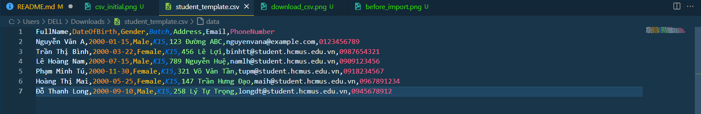
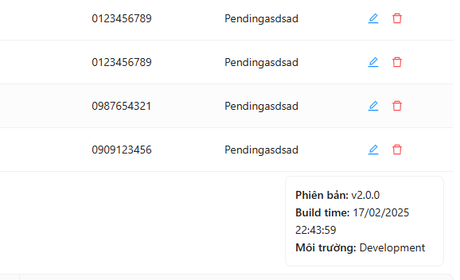

# Software-Design
## Name: Nguyen Hong Quan
# Student ID: 22127345

# **Quản Lý Danh Sách Sinh Viên**

## **Mô tả**
Đây là một ứng dụng giúp quản lý danh sách sinh viên với các chức năng như thêm, xóa, cập nhật và tìm kiếm sinh viên. Ứng dụng đảm bảo kiểm tra dữ liệu đầu vào và hỗ trợ các trường thông tin cần thiết.

# Week 1
## **Chức năng chính**
### ✅ **1. Thêm sinh viên mới**
- Nhập thông tin sinh viên và lưu vào danh sách.

Lưu ý ở phần thao tác sẽ có 2 icon. Icon đầu tiên ( hình cây bút) cho phép người dùng chỉnh sửa học sinh, trong khi icon thứ 2 ( thùng rác ) cho phép xóa học sinh
- Kiểm tra tính hợp lệ của **email, số điện thoại, tên khoa, tình trạng sinh viên** trước khi lưu.


### ✅ **2. Xóa sinh viên**
- Xóa thông tin sinh viên dựa trên **Mã số sinh viên (MSSV)**.
- Hiển thị thông báo xác nhận trước khi thực hiện xóa.


### ✅ **3. Cập nhật thông tin sinh viên**
- Cho phép cập nhật **họ tên, ngày sinh, giới tính, khoa, khóa, chương trình, địa chỉ, email, số điện thoại, tình trạng sinh viên** dựa trên **MSSV**.

Giả sử bây giờ ta cần cập nhật sinh viên Trần Thị B, Mã sinh viên 5. Ta bấm vào icon cây bút để mở ra modal chỉnh sửa và thực hiện đổi thông tin.

Danh sách sinh viên sau khi chỉnh sửa:


### ✅ **4. Tìm kiếm sinh viên**
- Hỗ trợ tìm kiếm sinh viên theo **họ tên hoặc MSSV**.
- Hiển thị danh sách sinh viên phù hợp với điều kiện tìm kiếm.


## **Dữ liệu quản lý**
Ứng dụng quản lý các thông tin sau của sinh viên:
- **Mã số sinh viên (MSSV)**
- **Họ tên**
- **Ngày tháng năm sinh**
- **Giới tính**
- **Khoa** _(Luật, Tiếng Anh thương mại, Tiếng Nhật, Tiếng Pháp)_
- **Khóa**
- **Chương trình**
- **Địa chỉ**
- **Email** _(Định dạng hợp lệ)_
- **Số điện thoại** _(Định dạng hợp lệ)_
- **Tình trạng sinh viên** _(Đang học, Đã tốt nghiệp, Đã thôi học, Tạm dừng học)_

## **Yêu cầu kỹ thuật**
- Ứng dụng có thể được viết bằng bất kỳ **ngôn ngữ lập trình** nào.
- Hỗ trợ giao diện **console, desktop hoặc web**.
- Kiểm tra dữ liệu nhập vào để đảm bảo tính hợp lệ.


## **Hướng dẫn cài đặt và sử dụng**

### **1. Yêu cầu hệ thống**
- Node.js (v14.0.0 trở lên)
- .NET 7.0 SDK
- SQL Server

### **2. Cài đặt**
#### Backend (.NET)
1. Clone repository:
```bash
git clone https://github.com/pinkWar123/Software-Design.git

```

2. Di chuyển vào thư mục backend:
```bash
cd backend
```

3. Khôi phục các packages:
```bash
dotnet restore
```

4. Cập nhật database:
```bash
dotnet ef database update
```

5. Chạy ứng dụng:
```bash
dotnet run
```
Backend sẽ chạy tại `http://localhost:5215`

#### Frontend (React)
1. Di chuyển vào thư mục frontend:
```bash
cd frontend
```

2. Cài đặt các dependencies:
```bash
npm install
```

3. Chạy ứng dụng:
```bash
npm start
```
Frontend sẽ chạy tại `http://localhost:5173`

### **3. Sử dụng**
1. Truy cập ứng dụng tại `http://localhost:5173`
2. Các chức năng chính:
   - Xem danh sách sinh viên
   - Thêm sinh viên mới
   - Cập nhật thông tin sinh viên
   - Xóa sinh viên
   - Tìm kiếm sinh viên theo tên hoặc mã số
   - Lọc sinh viên theo khoa
   - Import/Export danh sách sinh viên (CSV/JSON)

### **4. Lưu ý**
- Đảm bảo backend đang chạy khi sử dụng frontend
- Kiểm tra kết nối database trong file `appsettings.json`
- File import CSV/JSON cần đúng định dạng theo template

# Week 2
## **Chức năng chính**

### ✅ **1. Lưu Trữ Dữ Liệu**
- Hỗ trợ lưu trữ dữ liệu dưới dạng CSV, JSON hoặc Cơ sở dữ liệu để đảm bảo tính lâu dài.
- Cho phép lưu và truy xuất danh sách sinh viên từ định dạng đã chọn.

Database của dự án chính là sqlite. Khi khởi động lại app thì chỉ cần gọi API và lấy dữ liệu từ file này.


### ✅ **2. Cải Tiến Chức Năng Tìm Kiếm**
- Tìm kiếm sinh viên theo khoa.
- Tìm kiếm sinh viên theo khoa & tên.

Danh sách sinh viên trước khi tìm kiếm:


Tìm kiếm sinh viên theo khoa:


Tìm kiếm sinh viên theo khoa & tên:


### ✅ **3. Chức Năng Nhập & Xuất Dữ Liệu**
- Nhập dữ liệu sinh viên từ các tệp CSV, JSON.
- Xuất dữ liệu sinh viên sang các định dạng CSV, JSON.
Đây là các nút hỗ trợ việc nhập / xuất dữ liệu. Ngoài ra còn có 2 nút download template csv và json để giúp người dùng tạo ra file đúng định dạng của cấu trúc dữ liệu.


Ban đầu ta không có sinh viên nào cả:


Tải từ template csv:


Tự nhập thêm data:


Import lại dữ liệu từ file template:


Kết quả sau khi import:


Tương tự như thế ta có thể tải về template ở dạng json và điền thêm dữ liệu:


Import dữ liệu từ file này, ta thấy student mới nhất đã được thêm vào list


Xuất dữ liệu dạng json, file tự động được tải về:

Xem dữ liệu xuất ra:


### ✅ **4. Cơ Chế Ghi Log**
- Ghi lại nhật ký hoạt động bao gồm:
  - Thao tác của người dùng (thêm, xóa, cập nhật sinh viên)
  - Truy vấn tìm kiếm
  - Hoạt động nhập/xuất dữ liệu
- Log được lưu vào file riêng biệt để hỗ trợ gỡ lỗi và kiểm tra hệ thống


### ✅ **5. Hiển Thị Phiên Bản Ứng Dụng**
- Hiển thị:
  - Số phiên bản hiện tại của ứng dụng
  - Ngày và giờ build


### ✅ **6. Thêm Chức Năng Cho Phép Đổi Tên & Thêm Mới**
- Cho phép đổi tên & thêm mới:
  - Khoa
  - Tình trạng sinh viên
  - Chương trình

Danh sách các khoa:


Thêm khoa mới:


Sau khi nhấn nút thêm:


Bây giờ ta sẽ sửa tên một khoa. Chẳng hạn ta sửa tên khoa Hệ thống máy tính bằng cách nhấn vào nút Sửa.


Sửa tên thành Hệ thống máy:


Cập nhật lại và danh sách sau khi sửa:


Danh sách khoa sau khi sửa:


Danh sách các tình trạng sinh viên:


Danh sách các chương trình:


Các chức năng tương tự cũng có đối với tình trạng sinh viên và chương trình.
