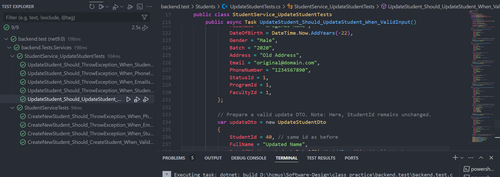

05. Các khó khăn gặp phải trong quá trình unit test và cải tiến.
    - Frameword mà em sử dụng để test trong dự án ASP.NET Core là xUnit. Ngoài ra có sử dụng thêm một số công cụ như Moq để mock các dependency, hay FluentAssertions để viết các assertion.
    - Em dự tính viết unit test cho các phương thức của StudentService.
    - Tuy nhiên, việc mock các phương thức của DbContext và các phương thức của các dependency khá khó khăn.


  ```csharp
public class StudentService : IStudentService
{
    private readonly StudentSettings _studentSettings;
    private readonly StudentStatusTransitions _studentStatusTransitions;
    private readonly ApplicationDbContext _context;
    private readonly IStatusRepository _statusRepository;
    
    public StudentService(ApplicationDbContext context, IOptions<StudentSettings> studentSettings, IOptions<StudentStatusTransitions> studentStatusTransitions, IStatusRepository statusRepository)
    {
        _context = context;
        _studentSettings = studentSettings.Value;
        _studentStatusTransitions = studentStatusTransitions.Value;
        _statusRepository = statusRepository;
    }

    // Methods
}
```
- Ta có thể thấy StudentService phụ thuộc vào ApplicationDbContext, IOptions<StudentSettings>, IOptions<StudentStatusTransitions> và IStatusRepository.
- Vấn đề ở đây là, ta không thể mock được ApplicationDbContext, bởi vì lớp này không có constructor không tham số (parameterless constructor) và phụ thuộc vào các đối tượng như DbContextOptions mà Moq không thể tự động cung cấp. Ngoài ra, EF Core không được thiết kế để mock toàn bộ DbContext vì nó chứa nhiều logic phức tạp liên quan đến truy vấn cơ sở dữ liệu.
    

- Do đó để giải quyết này, em tạo ra một interface IApplicationDbContext và định nghĩa các phương thức mà ta cần thiết.
    
    ```csharp
    public interface IApplicationDbContext
    {
        DbSet<Student> Students { get; set; }
        DbSet<Faculty> Faculties { get; set; }
        DbSet<StudyProgram> StudyPrograms { get; set; }
        DbSet<Status> Statuses { get; set; }
        DbSet<StatusTransition> StatusTransitions { get; set; }
        Task<int> SaveChangesAsync(CancellationToken cancellationToken = default);
    }
    ```

    ```csharp
    public class ApplicationDbContext : DbContext, IApplicationDbContext
    {
        // Implement the interface
    }
    ```

    - Nhờ như vậy mà bây giờ ta dễ dàng mock được IApplicationDbContext và các dependency khác.
    ```csharp
    public class StudentServiceTests
    {
        private readonly Mock<IApplicationDbContext> _context;
        private readonly IStudentService _studentService;
        private readonly IOptions<StudentSettings> _studentSettings;
        private readonly IOptions<StudentStatusTransitions> _studentStatusTransitions;
        private readonly IStatusRepository _statusRepository;

        public StudentServiceTests()
        {
            // Set up an in-memory database.
            
            _context = new Mock<IApplicationDbContext>();

            // Configure StudentSettings with a simple regex for phone and a valid email domain.
            var settings = new StudentSettings { PhoneNumber = @"^\d+$", EmailDomain = "@domain.com" };
            _studentSettings = Options.Create(settings);

            // For student status transitions, use default/empty settings as they are not used in CreateNewStudent.
            var transitions = new StudentStatusTransitions();
            _studentStatusTransitions = Options.Create(transitions);

            // Create a dummy status repository (not used by CreateNewStudent).
            var statusRepoMock = new Mock<IStatusRepository>();
            _statusRepository = statusRepoMock.Object;

            _studentService = new StudentService(_context.Object, _studentSettings, _studentStatusTransitions, _statusRepository);
        }

        // Test cases
    }
    ```
- Và để test, ta chỉ cần sử dụng Moq để giả lập dữ liệu từ IApplicationDbContext. Điều này giúp ta không phụ thuộc vào persistent storage và có thể tập trung vào việc test logic của phương thức.
    ```csharp
        [Fact]
        public async Task CreateNewStudent_Should_ThrowException_When_StudentIdAlreadyExists()
        {
            // Arrange: Add a student with StudentId = 3.
            var existingStudent = new Student
            {
                StudentId = 3,
                FullName = "Existing Student",
                DateOfBirth = DateTime.Now.AddYears(-20),
                Gender = "Male",
                Batch = "2020",
                Address = "123 Street",
                Email = "existing@domain.com",
                PhoneNumber = "1234567890",
                StatusId = 1,
                ProgramId = 1,
                FacultyId = 1,
            };

            // Attempt to add another student with the same StudentId.
            var studentDto = new CreateStudentDto
            {
                StudentId = 3, // Duplicate ID
                FullName = "Test Student",
                DateOfBirth = DateTime.Now.AddYears(-20),
                Gender = "Male",
                Batch = "2020",
                Address = "123 Street",
                Email = "test@domain.com",
                PhoneNumber = "1234567890",
                StatusId = 1,
                ProgramId = 1,
                FacultyId = 1,
            };

            _context.Setup(c => c.Students.FindAsync(studentDto.StudentId)).ReturnsAsync(existingStudent);

            // Act & Assert
            Func<Task> act = async () => await _studentService.CreateNewStudent(studentDto);
            await act.Should().ThrowAsync<Exception>()
                .WithMessage("Mã sinh viên đã tồn tại");
        }
    ```
    Chẳng hạn như ở hàm trên, em đã set up để hàm FindAsync của _context trả về một sinh viên đã tồn tại. Khi đó, hàm CreateNewStudent sẽ throw ra một exception.


- Kết quả chạy unit test:

    